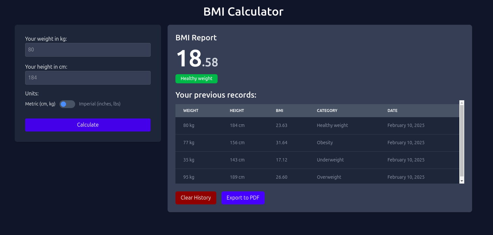

# Advance BMI Calculator

This BMI Calculator is a simple yet powerful web application that helps users calculate their Body Mass Index (BMI) based on their weight and height. The app features unit conversion, allowing users to switch between Metric (kg, cm) and Imperial (lbs, inches) measurement systems seamlessly.

## Key Features

- ✅ User-Friendly Interface – Clean and intuitive design for easy input.

- ✅ BMI Calculation – Computes BMI based on user input and categorizes it (Underweight, Healthy, Overweight, Obesity).
- ✅ Unit Conversion – Toggle between Metric (kg/cm) and Imperial (lbs/inches) units effortlessly.
- ✅ Result Display – Shows BMI value along with a dynamically colored category indicator.
- ✅ History Tracking – Stores past BMI calculations in a scrollable table with timestamps.
- ✅ Responsive Design – Works across devices with a modern UI.

## Screenshots

### Main Page

### Exported PDF

## Technology Used

- React v19.0 -> useState, useEffect, localStorage, jspdf
- Tailwind v4
- bun package manager
